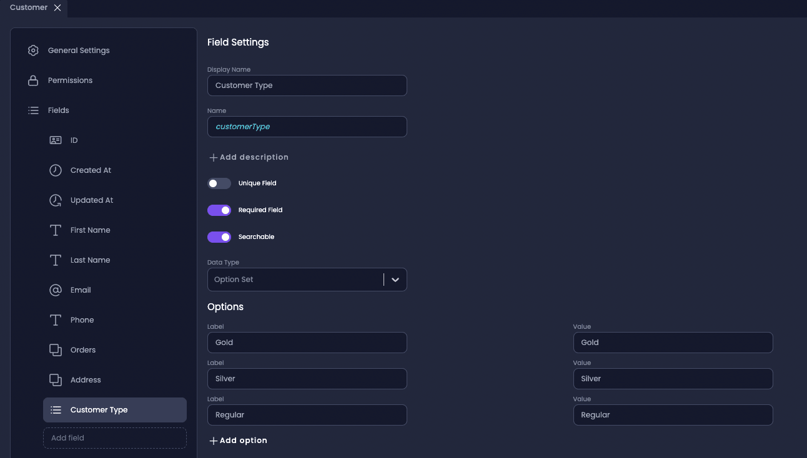
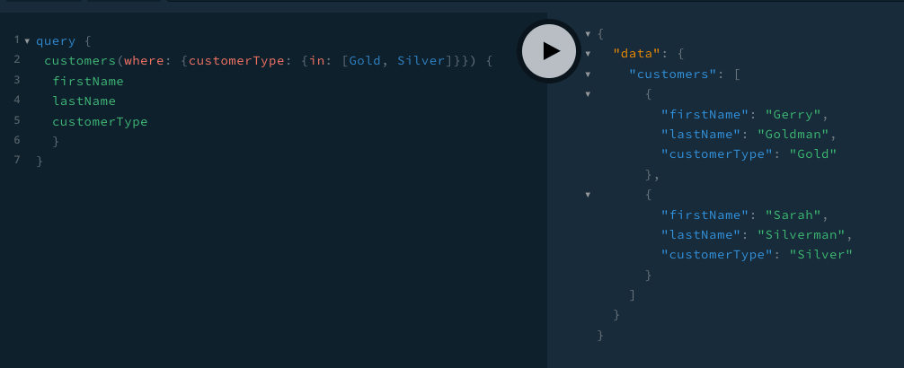

# How to add a custom DTO

## General
A DTO (Data Access Object) is an object that defines how the data will be sent over the network.
DTOs can be defined by TypeScript interfaces or by classes. It is preferable to use classes, as TypeScript interfaces are removed during the transpilation, and can't be referred to at runtime. However, classes are part of the JavaScript ES6 standard and are therefore preserved as real entities in the compiled JavaScript.

## The Problem
The DTOs in Amplication are generated based on the relations between the entities,Prisma schema, and types.
In addition to the default DTOs generated by Amplication, you may need to create a new custom DTO or extend an existing one.

For example, let's say you have an application with a Customer entity, and you want to filter all the customers by the property _customerType_.
The data type of _customerType_ field is _option set_, and in the generated code is translated to an _enum_.



In the generated app, you will get a DTO named `CustomerFindManyArgs` with a field (for GraphQL) or ApiProperty (for REST) from type: `CustomerWhereInput`.

```typescript
@ApiProperty({
    required: false,
    type: () => CustomerWhereInput,
})
@Field(() => CustomerWhereInput, { nullable: true })
@Type(() => CustomerWhereInput)
where?: CustomerWhereInput;
```
`CustomerWhereInput` has its own fields/API properties, including `EnumCustomerCustomerType`

```typescript
@ApiProperty({
    required: false,
    enum: EnumCustomerCustomerType,
})
@IsEnum(EnumCustomerCustomerType)
@IsOptional()
@Field(() => EnumCustomerCustomerType, { nullable: true })
customerType?: "Gold" | "Silver" | "Regular";
```

The Customer model from Prisma schema:

```prisma
model Customer {
  address      Address?                 @relation(fields: [addressId], references: [id])
  addressId    String?
  createdAt    DateTime                 @default(now())
  customerType EnumCustomerCustomerType
  email        String?
  firstName    String?
  id           String                   @id @default(cuid())
  lastName     String?
  orders       Order[]
  phone        String?
  updatedAt    DateTime                 @updatedAt
}
```

```typescript
export enum EnumCustomerCustomerType {
  Gold = "Gold",
  Silver = "Silver",
  Regular = "Regular",
}
```

In Amplication, we support string filtering, but not enums filtering. So, in this case, we need to create a custom DTO.

When you try to query, for example, all the customer with the customer type _Gold_ or _Silver_, you will get the following error:


## The solution:
The following example will demonstrate how to add a new custom DTO for filtering on enums, and how to use it through the application instead of the base DTO.
1. Find the right DTO

According to Prisma, _EntityWhereInput_ wraps all model fields in a type so that the list can be **filtered by any property**. 

[Prisma findMany](https://www.prisma.io/docs/reference/api-reference/prisma-client-reference#findmany)

`CustomerWhereInput` that was generated by Prisma:

```typescript
export type CustomerWhereInput = {
    address?: XOR<AddressRelationFilter, AddressWhereInput> | null
    addressId?: StringNullableFilter | string | null
    createdAt?: DateTimeFilter | Date | string
    customerType?: EnumEnumCustomerCustomerTypeFilter | EnumCustomerCustomerType
    email?: StringNullableFilter | string | null
    firstName?: StringNullableFilter | string | null
    id?: StringFilter | string
    lastName?: StringNullableFilter | string | null
    orders?: OrderListRelationFilter
    phone?: StringNullableFilter | string | null
    updatedAt?: DateTimeFilter | Date | string
}
```

The type that we are looking for is the type of the property `customerType`:  `EnumEnumCustomerCustomerTypeFilter`

```typescript
export type EnumEnumCustomerCustomerTypeFilter = {
    equals?: EnumCustomerCustomerType
    in?: Enumerable<EnumCustomerCustomerType>
    notIn?: Enumerable<EnumCustomerCustomerType>
    not?: NestedEnumEnumCustomerCustomerTypeFilter | EnumCustomerCustomerType
}
```


2. In the customer folder, create a new folder named `dtos`
3. Inside this folder, create a two new files: `CustomerWhereInputWithFilterEnum.ts` and `EnumEnumCustomerCustomerTypeFilter.ts`
4. In `EnumEnumCustomerCustomerTypeFilter.ts` file create a new class `EnumEnumCustomerCustomerTypeFilter` with the following properties:
(`equals`, `in`, `notIn` and  `not`) as shown above:

```typescript
import { Field, InputType } from "@nestjs/graphql";
import { ApiProperty } from "@nestjs/swagger";
import { IsOptional } from "class-validator";
import { Type } from "class-transformer";
import { EnumCustomerCustomerType } from "../base/EnumCustomerCustomerType";

@InputType({
  isAbstract: true,
})
export class EnumEnumCustomerCustomerTypeFilter {
  @ApiProperty({
    required: false,
    type: EnumCustomerCustomerType,
  })
  @IsOptional()
  @Field(() => EnumCustomerCustomerType, {
    nullable: true,
  })
  @Type(() => String)
  equals?: EnumCustomerCustomerType;

  @ApiProperty({
    required: false,
    type: [EnumCustomerCustomerType],
  })
  @IsOptional()
  @Field(() => [EnumCustomerCustomerType], {
    nullable: true,
  })
  @Type(() => String)
  in?: EnumCustomerCustomerType[];

  @ApiProperty({
    required: false,
    type: [EnumCustomerCustomerType],
  })
  @IsOptional()
  @Field(() => [EnumCustomerCustomerType], {
    nullable: true,
  })
  @Type(() => String)
  notIn?: EnumCustomerCustomerType[];

  @ApiProperty({
    required: false,
    type: EnumCustomerCustomerType,
  })
  @IsOptional()
  @Field(() => EnumCustomerCustomerType, {
    nullable: true,
  })
  @Type(() => String)
  not?: EnumCustomerCustomerType;
}
```

5. In `CustomerWhereInputWithFilterEnum.ts` file create a new class `CustomerWhereInputWithFilterEnum` decorated by `@InputType()`:

```typescript
@InputType()
class CustomerWhereInputWithFilterEnum {
    @ApiProperty({
        required: false,
        enum: EnumEnumCustomerCustomerTypeFilter,
    })
    @IsEnum(EnumEnumCustomerCustomerTypeFilter)
    @IsOptional()
    @Field(() => EnumEnumCustomerCustomerTypeFilter, {
    nullable: true,
    })
    customerType?: EnumEnumCustomerCustomerTypeFilter;
}       
```
This class should look exactly like `CustomerWhereInput`, except the type of `customerType` field/API property that its type should be `EnumEnumCustomerCustomerTypeFilter`. Therefore, you need to copy and paste the other properties from the `CustomerWhereInput` DTO.

6. Change the type of the `where` property in `CustomerFindManyArgs` to `CustomerWhereInputWithFilterEnum`

```typescript
import { CustomerWhereInputWithFilterEnum } from "../dtos/CustomerWhereInputWithFilterEnum";

@ArgsType()
class CustomerFindManyArgs {
  @ApiProperty({
    required: false,
    type: () => CustomerWhereInputWithFilterEnum,
  })
  @Field(() => CustomerWhereInputWithFilterEnum, { nullable: true })
  @Type(() => CustomerWhereInputWithFilterEnum)
  where?: CustomerWhereInputWithFilterEnum;
}
```

## Check your changes

You are ready to check your changes. Just save all changes and restart your server.
Navigate to http://localhost:3000/graphql/ for GraphQL and http://localhost:3000/api/ for REST to see and execute the new query.

After restarting the server, you will see in `/server/schema.graphql` the new input type: `CustomerWhereInputWithFilterEnum`

```graphql
input CustomerWhereInputWithFilterEnum {
  address: AddressWhereUniqueInput
  customerType: EnumEnumCustomerCustomerTypeFilter
  email: StringNullableFilter
  firstName: StringNullableFilter
  id: StringFilter
  lastName: StringNullableFilter
  orders: OrderListRelationFilter
  phone: StringNullableFilter
}
```

On GraphQL playground you will be able to create a query with _enum filter_



:::tip
You can run your server in watch mode, which automatically restarts whenever a file in the server code is changed.
Instead of using **npm start**, you should use this command.

```
nest start --debug --watch
```

:::
