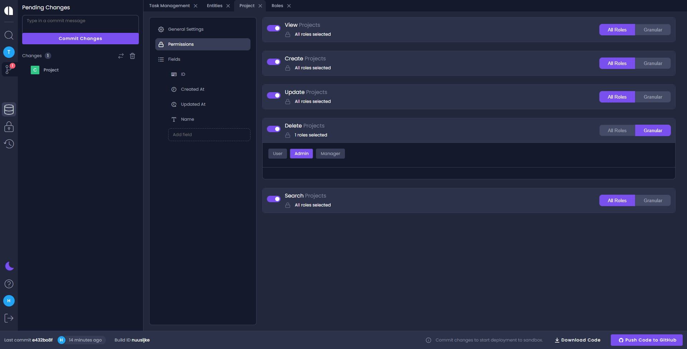
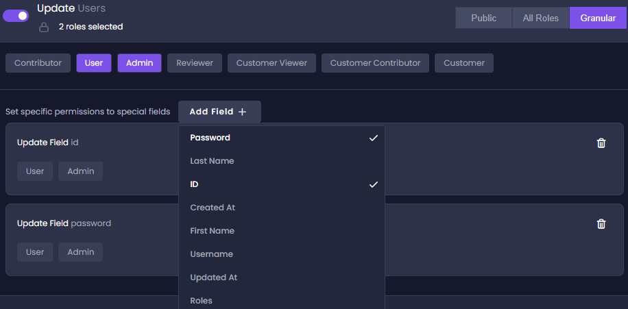
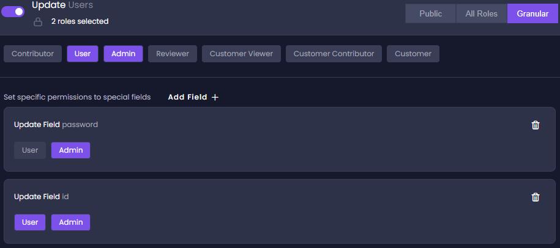

# Set Access Permissions 

To control users to access an entity, we must set its permissions. We can also set permissions at the field level. 

Permissions can be controlled separately for each of the following actions:

- **View**
- **Create**
- **Update**
- **Delete**
- **Search**

By default, ALL these actions are permitted for all roles.

## Set Entity Permissions

1. Click the **Entities** icon in the main menu (leftsidebar) to open the _Entities_ page.
2. Click an entity.
3. On the entity's page, click **Permissions**.

   By default, all actions (_View_, _Create_, _Update_, _Delete_, and _Search_) are set to **All Roles**. 

4. Select **Granular** to enable the configuration of the actions according to specific roles.

5. To give a specific role permission to perform the action, select the appropriate button. 

   For example, we can give permissions to perform the **Delete** action to the **Admin** role. 

## Set Field Permissions 

You can set permissions at the field level.

 1. Click **+ Add Field** and select the required fields from the drop-down list.

2. Select the roles you want to associate with each selected field. 

